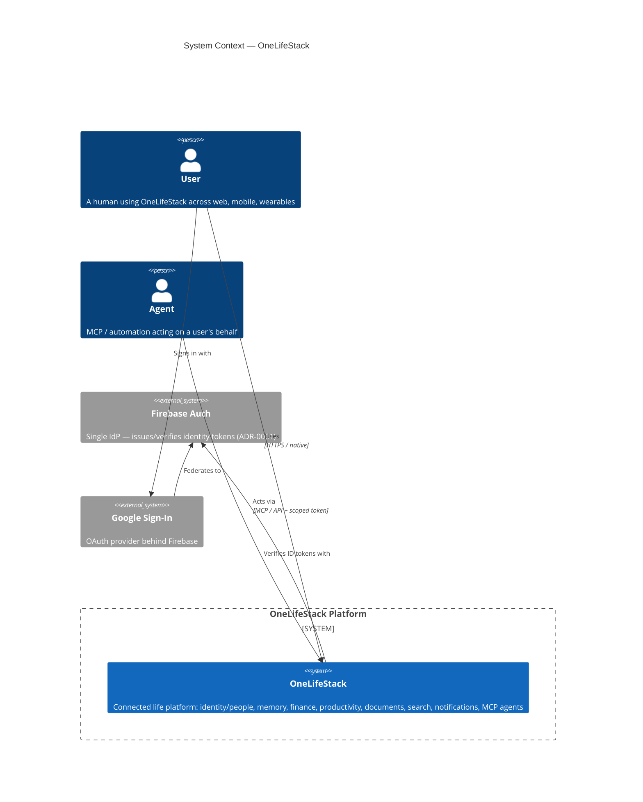
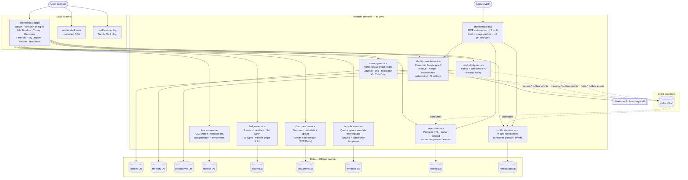
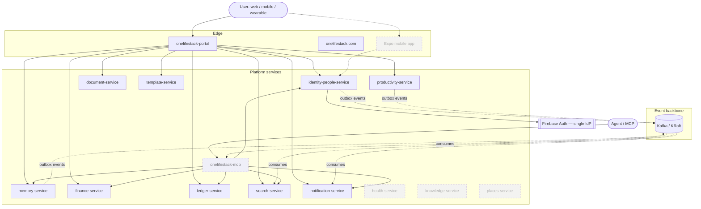
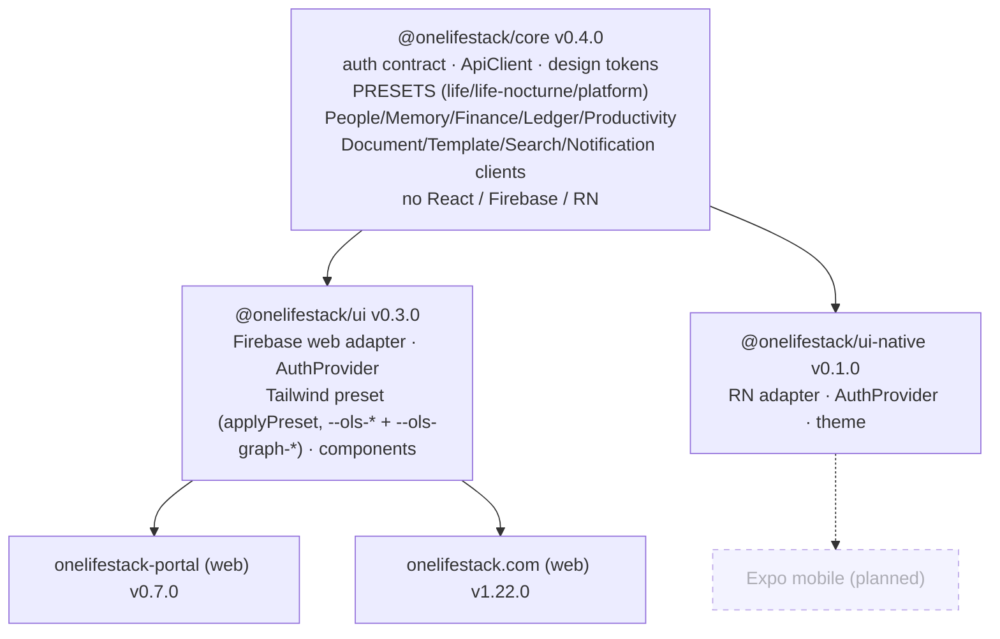
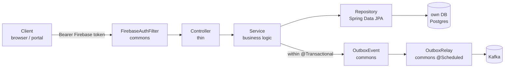

# OneLifeStack — Architecture (C4 diagrams)

Diagrams-as-code (Mermaid, renders natively on GitHub). Following the **C4 model**: System Context →
Containers. Each diagram marks what's **live today** vs. **target/planned**. The narrative source of
truth is `PLATFORM-PLAN.md`; current build status is `FOUNDATION-STATUS.md`; key decisions are in
[`adr/`](adr/README.md).

---

## Level 1 — System Context

Who uses OneLifeStack and the external systems it depends on.

---

## Level 2 — Containers (live as of 2026-06-05)

All services below are deployed in a homelab k3s dev cluster. Each owns its own database; no
cross-DB joins — services integrate via events and typed APIs only.

**Key cross-cutting wiring:**
- All backend services authenticate via Firebase Admin SDK (shared `onelifestack-backend-firebase` k8s secret).
- Commons Spring Boot starter (`onelifestack-commons`) provides: auth filter, error envelope, CORS, audit logging, outbox/event relay — zero reimplementation per service.
- `memory-service` and `ledger-service` call `identity-people-service /resolve` to link named people into the canonical graph.
- `ledger-service` calls `identity-people-service /check` to enforce AccessGrant-based access for non-owners.

---

## Level 2 — Containers (target state)

Near-term additions: MCP deployment, mobile client, SpendStack migration, LifeLog decomposition.

---

## Shared-code layering (frontend)

How the client packages stack — platform-agnostic core, then per-platform UI kits, then apps.

All three packages are published to GitHub Packages (`npm.pkg.github.com`) and consumed via
versioned registry deps. See [ADR-0004](adr/0004-file-deps-until-packages-published.md).

---

## Backend service pattern

Every backend service follows the same shape, enforced by `onelifestack-commons`.

Key properties: stateless (no sessions), constructor injection only, Flyway migrations,
`ddl-auto: validate`, `CurrentUser.require()` for ownership scoping.
