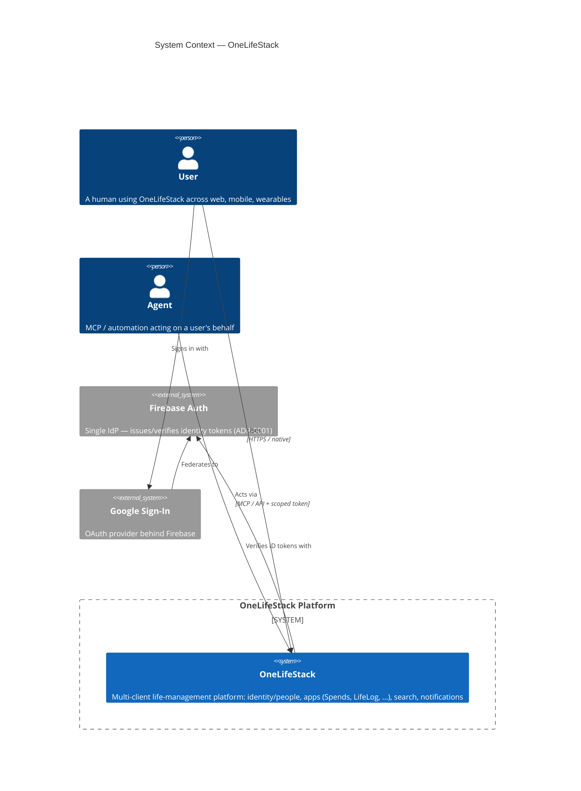
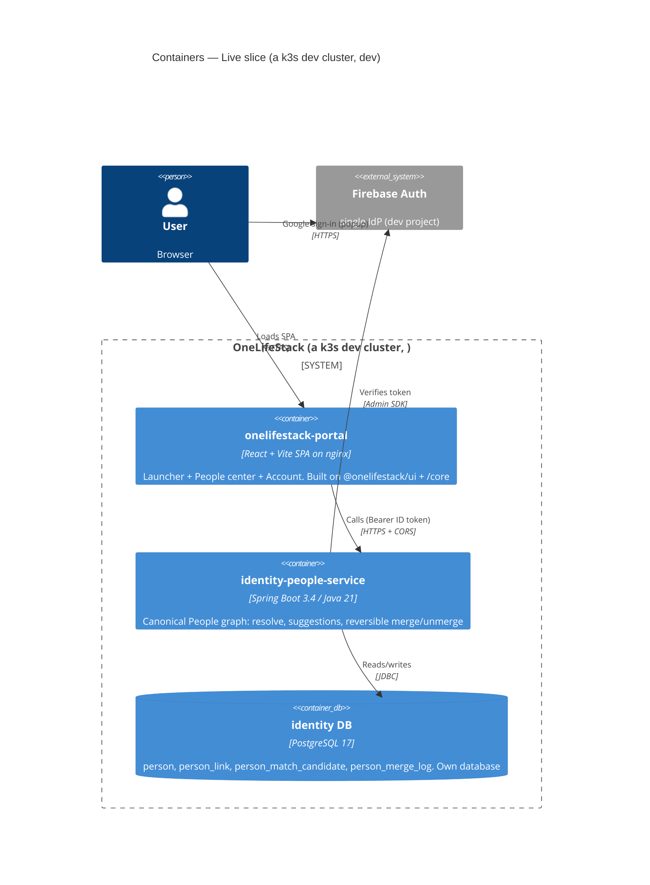
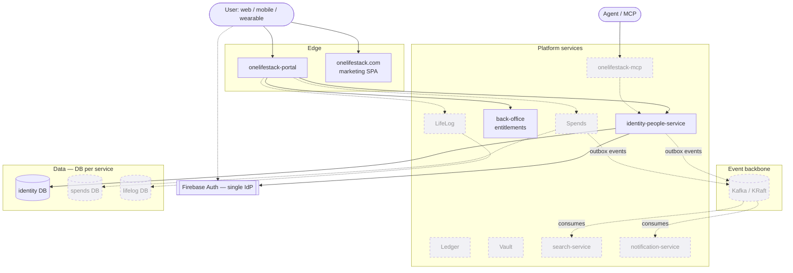
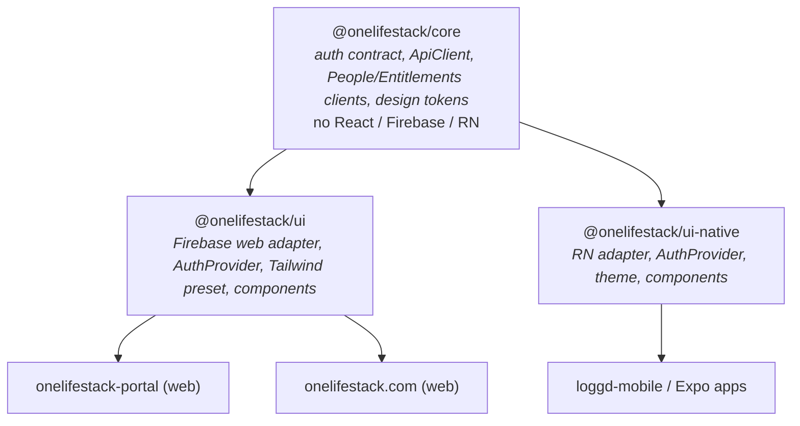

# OneLifeStack — Architecture (C4 diagrams)

Diagrams-as-code (Mermaid, renders natively on GitHub). Following the **C4 model**: System Context →
Containers. Each diagram marks what's **live today** vs. **target/planned**. The narrative source of
truth is `PLATFORM-PLAN.md`; current build status is `FOUNDATION-STATUS.md`; key decisions are in
[`adr/`](adr/README.md).

---

## Level 1 — System Context

Who uses OneLifeStack and the external systems it depends on.

---

## Level 2 — Containers (current live slice)

What's **actually deployed** in a k3s dev cluster today . This is the first vertical slice.

**Proven end-to-end:** Google sign-in → Firebase token → portal → CORS → people service → Postgres →
back to the browser. Auth is enforced (unauthenticated `/api/v1/people` → 403).

---

## Level 2 — Containers (target state)

Where this is heading, per `PLATFORM-PLAN.md`. Dashed = not built yet.

Key principles encoded above (see ADRs): Firebase is the **single IdP** ([0001](adr/0001-firebase-single-idp.md));
each service owns its **own DB, no cross-DB joins**, integrating via **events + APIs**
([0003](adr/0003-db-per-service-no-cross-db-joins.md)); Search/Notifications are dedicated consumers
of the event backbone.

---

## Shared-code layering (frontend)

How the client packages stack — platform-agnostic core, then per-platform UI kits, then apps.

> Today the apps consume core/ui via local `file:` deps (not yet published) —
> [ADR-0004](adr/0004-file-deps-until-packages-published.md).
